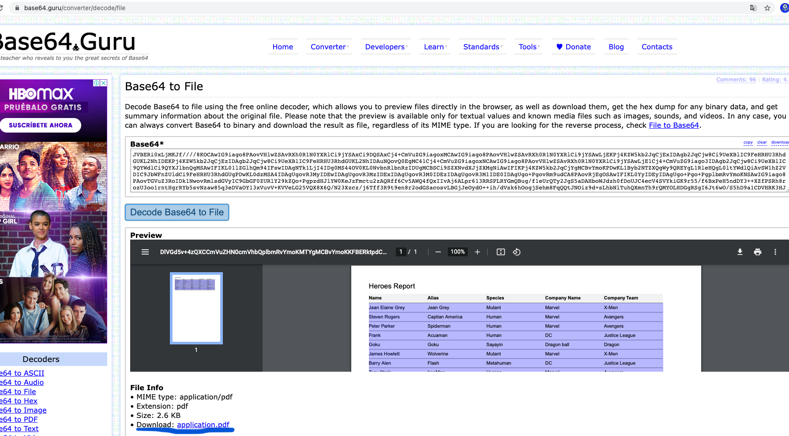
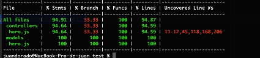

<!--
layout: Doc
framework: v2
platform: AWS
language: nodeJS
-->

# AWS Report Test

En este proyecto se podrán crear, actualizar, buscar, eliminar, y listar héroes. También se podrán generar reportes en PDF y Excel de todos los héroes almacenados en la base de datos. El proyecto se encuentra desarrollado con Node JS usando Express para exponer los servicios que permiten usar cada una de sus funcionalidades. 

Se usa Serverless Framework, ya que brinda la facilidad de desarrollar y desplegar la aplicación en una infraestructura como código. Para la base de datos se usa DynamoDB de AWS. Toda la aplicación se encuentra desplegada en AWS usando Cloudformation, Lambda, API Gategay, entre otros servicios y es completamente funcional.    

### URL base:
https://0fwx8bmib4.execute-api.us-east-1.amazonaws.com

### Documentación de la API:
https://documenter.getpostman.com/view/552257/UV5WEJJW

### Reportes

La respuesta de los servicios que generan el reporte en PDF o Excel, retornara un archivo codificado en base 64, para ver o descargar su contenido se recomienda usar el sitio web https://base64.guru/converter/decode/file en el cual se debe de pegar el base 64 obtenido en el resultado del servicio. 



### Despliegue

Se debe de instalar las dependencias con el siguiente comando:

```
npm install
```

Posteriormente, para desplegar se debe de ejecutar el siguiente comando: (Se debe de tener configurado un perfil y usuario de AWS en el equipo usado para realizar el despliegue)

```
serverless deploy
```

Después de ejecutar el comando anterior, debería ver un resultado similar a:

```bash
Serverless: Packaging service...
Serverless: Excluding development dependencies...
Serverless: Creating Stack...
Serverless: Checking Stack create progress...
........
Serverless: Stack create finished...
Serverless: Uploading CloudFormation file to S3...
Serverless: Uploading artifacts...
Serverless: Uploading service aws-node-express-dynamodb-api.zip file to S3 (718.53 KB)...
Serverless: Validating template...
Serverless: Updating Stack...
Serverless: Checking Stack update progress...
....................................
Serverless: Stack update finished...
Service Information
service: aws-node-express-dynamodb-api
stage: dev
region: us-east-1
stack: aws-node-express-dynamodb-api-dev
resources: 13
api keys:
  None
endpoints:
  ANY - https://xxxxxxx.execute-api.us-east-1.amazonaws.com/
functions:
  api: aws-node-express-dynamodb-api-dev-api
layers:
  None
```

### Resultados de pruebas unitarias realizadas



